# 💼 Exemplo de Integração Real - Kwai Pixel

## 🎯 Cenário: Sistema de Depósito

Este guia mostra como integrar o Kwai Pixel em um sistema real de depósito, do início ao fim.

---

## 📁 Estrutura do Sistema de Depósito

```
app/
├── (authenticated)/
│   └── deposit/
│       ├── page.tsx           # Página de depósito
│       └── DepositModal.tsx   # Modal de depósito
└── api/
    └── deposits/
        └── route.ts           # API de depósito
```

---

## 🔥 Implementação Passo a Passo

### 1️⃣ Página de Depósito

**Arquivo**: `app/(authenticated)/deposit/page.tsx`

```tsx
'use client'

import { useEffect, useState } from 'react'
import { useKwaiTracker } from '@/lib/hooks/useKwaiTracker'
import { DepositModal } from './DepositModal'

export default function DepositPage() {
  const [isModalOpen, setIsModalOpen] = useState(false)
  const { trackPageView, hasClickId } = useKwaiTracker()

  // Rastrear visualização da página
  useEffect(() => {
    trackPageView({
      content_name: 'pagina_deposito',
      content_type: 'deposit_page',
    })
  }, [trackPageView])

  // Mostrar bônus se vier de campanha
  const showBonusBanner = hasClickId()

  return (
    <div className="container mx-auto p-4">
      <h1 className="text-3xl font-bold mb-6">Fazer Depósito</h1>

      {showBonusBanner && (
        <div className="bg-yellow-100 border-yellow-400 p-4 rounded mb-4">
          🎉 Você tem um bônus especial de boas-vindas!
        </div>
      )}

      <button
        onClick={() => setIsModalOpen(true)}
        className="bg-green-500 hover:bg-green-600 text-white px-6 py-3 rounded"
      >
        Depositar Agora
      </button>

      <DepositModal
        isOpen={isModalOpen}
        onClose={() => setIsModalOpen(false)}
      />
    </div>
  )
}
```

---

### 2️⃣ Modal de Depósito

**Arquivo**: `app/(authenticated)/deposit/DepositModal.tsx`

```tsx
'use client'

import { useState } from 'react'
import { useKwaiTracker } from '@/lib/hooks/useKwaiTracker'
import api from '@/lib/api'
import toast from 'react-hot-toast'

interface DepositModalProps {
  isOpen: boolean
  onClose: () => void
}

export function DepositModal({ isOpen, onClose }: DepositModalProps) {
  const [valor, setValor] = useState(50)
  const [loading, setLoading] = useState(false)
  const [pixCode, setPixCode] = useState('')
  const [paymentId, setPaymentId] = useState('')

  const { trackInitiatedCheckout, trackPurchase } = useKwaiTracker()

  // Valores predefinidos
  const valores = [20, 50, 100, 200, 500]

  // STEP 1: Usuário abre o modal
  // Já rastreado automaticamente pelo componente pai

  // STEP 2: Usuário seleciona valor e clica em "Continuar"
  const handleContinue = async () => {
    setLoading(true)

    try {
      // 🔥 RASTREAR: Usuário iniciou o checkout
      trackInitiatedCheckout(valor, {
        content_type: 'deposit',
        content_name: 'modal_deposito',
      })

      // Criar ordem de depósito no backend
      const response = await api.post('/deposits', {
        valor,
        metodo: 'pix',
      })

      const { pix_code, payment_id } = response.data

      setPixCode(pix_code)
      setPaymentId(payment_id)

      toast.success('QR Code gerado! Escaneie para pagar.')
    } catch (error) {
      toast.error('Erro ao gerar QR Code')
      console.error(error)
    } finally {
      setLoading(false)
    }
  }

  // STEP 3: Backend confirma o pagamento via webhook
  // Este método será chamado quando o webhook confirmar
  const handlePaymentConfirmed = () => {
    // 🔥🔥 RASTREAR: CONVERSÃO CONFIRMADA 🔥🔥
    trackPurchase(valor, paymentId, {
      payment_method: 'pix',
      content_type: 'deposit',
      content_name: 'deposito_confirmado',
    })

    toast.success(`Depósito de R$ ${valor} confirmado!`)
    onClose()
  }

  if (!isOpen) return null

  return (
    <div className="fixed inset-0 bg-black bg-opacity-50 flex items-center justify-center z-50">
      <div className="bg-white rounded-lg p-6 max-w-md w-full">
        <h2 className="text-2xl font-bold mb-4">Depositar</h2>

        {!pixCode ? (
          // Seleção de valor
          <>
            <div className="mb-4">
              <label className="block text-sm font-medium mb-2">
                Selecione o valor
              </label>
              <div className="grid grid-cols-3 gap-2">
                {valores.map((v) => (
                  <button
                    key={v}
                    onClick={() => setValor(v)}
                    className={`p-3 rounded border-2 ${
                      valor === v
                        ? 'border-green-500 bg-green-50'
                        : 'border-gray-300'
                    }`}
                  >
                    R$ {v}
                  </button>
                ))}
              </div>
            </div>

            <button
              onClick={handleContinue}
              disabled={loading}
              className="w-full bg-green-500 hover:bg-green-600 text-white py-3 rounded disabled:opacity-50"
            >
              {loading ? 'Gerando...' : 'Continuar'}
            </button>
          </>
        ) : (
          // QR Code PIX
          <>
            <div className="mb-4 text-center">
              <p className="text-sm text-gray-600 mb-2">
                Escaneie o QR Code para pagar
              </p>
              <div className="bg-gray-100 p-4 rounded">
                {/* Aqui você colocaria o componente de QR Code */}
                <div className="text-xs break-all">{pixCode}</div>
              </div>
            </div>

            <div className="bg-blue-50 border-blue-200 p-3 rounded text-sm">
              💡 Aguardando pagamento... O depósito será creditado automaticamente.
            </div>
          </>
        )}

        <button
          onClick={onClose}
          className="w-full mt-4 text-gray-600 hover:text-gray-800"
        >
          Fechar
        </button>
      </div>
    </div>
  )
}
```

---

### 3️⃣ API Route de Depósito

**Arquivo**: `app/api/deposits/route.ts`

```tsx
import { NextRequest, NextResponse } from 'next/server'
import { sendInitiatedCheckoutEvent, sendPurchaseEvent } from '@/lib/kwai-server-api'

// POST /api/deposits - Criar ordem de depósito
export async function POST(request: NextRequest) {
  try {
    const { valor, metodo } = await request.json()

    // Validar dados
    if (!valor || valor < 10) {
      return NextResponse.json(
        { error: 'Valor mínimo: R$ 10' },
        { status: 400 }
      )
    }

    // Criar ordem de pagamento no seu sistema
    const payment_id = `TXN-${Date.now()}`
    const pix_code = `00020126580014br.gov.bcb.pix...` // Seu código PIX

    // (Opcional) Enviar evento server-side também
    try {
      const pixelConfig = {
        pixel_id: process.env.KWAI_PIXEL_ID!,
        access_token: process.env.KWAI_ACCESS_TOKEN!,
      }

      // Obter clickid do header (se enviado pelo frontend)
      const clickid = request.headers.get('x-kwai-clickid') || undefined

      await sendInitiatedCheckoutEvent(pixelConfig, {
        value: valor,
        clickid,
      })
    } catch (error) {
      console.error('Erro ao enviar evento Kwai server-side:', error)
      // Não falhar a requisição por causa disso
    }

    return NextResponse.json({
      payment_id,
      pix_code,
      valor,
    })
  } catch (error) {
    console.error('Erro ao criar depósito:', error)
    return NextResponse.json(
      { error: 'Erro ao processar depósito' },
      { status: 500 }
    )
  }
}
```

---

### 4️⃣ Webhook de Confirmação

**Arquivo**: `app/api/webhooks/payment-confirm/route.ts`

```tsx
import { NextRequest, NextResponse } from 'next/server'
import { sendPurchaseEvent } from '@/lib/kwai-server-api'

// POST /api/webhooks/payment-confirm
// Chamado pelo gateway de pagamento quando o PIX é confirmado
export async function POST(request: NextRequest) {
  try {
    const { payment_id, valor, status } = await request.json()

    if (status !== 'approved') {
      return NextResponse.json({ received: true })
    }

    // Atualizar depósito no banco de dados
    // ... seu código aqui ...

    // 🔥 ENVIAR EVENTO DE CONVERSÃO PARA O KWAI
    try {
      const pixelConfig = {
        pixel_id: process.env.KWAI_PIXEL_ID!,
        access_token: process.env.KWAI_ACCESS_TOKEN!,
      }

      // Buscar clickid do usuário (salvo no banco quando ele acessou)
      // const clickid = await getUserClickId(user_id)

      await sendPurchaseEvent(pixelConfig, {
        value: valor,
        transaction_id: payment_id,
        payment_method: 'pix',
        // clickid,
      })

      console.log('✅ Evento de conversão enviado ao Kwai')
    } catch (error) {
      console.error('Erro ao enviar conversão Kwai:', error)
      // Não falhar o webhook por causa disso
    }

    return NextResponse.json({ received: true })
  } catch (error) {
    console.error('Erro no webhook:', error)
    return NextResponse.json(
      { error: 'Erro ao processar webhook' },
      { status: 500 }
    )
  }
}
```

---

## 🔄 Fluxo Completo com Rastreamento

```mermaid
graph TD
    A[Usuário clica em anúncio Kwai] -->|?kwai_pixel=XXX&clickid=ABC| B[Entra no site]
    B --> C[Pixel carregado - trackPageView automático]
    C --> D[Usuário abre Modal de Depósito]
    D --> E[trackInitiatedCheckout disparado]
    E --> F[Usuário confirma valor e gera PIX]
    F --> G[QR Code exibido - aguardando pagamento]
    G --> H[Usuário paga via PIX]
    H --> I[Webhook recebe confirmação]
    I --> J[trackPurchase disparado - CONVERSÃO!]
    J --> K[Kwai registra conversão e atribui à campanha]
```



---

## 📊 Eventos Disparados no Fluxo

| Momento | Evento | Local | Tipo |
|---------|--------|-------|------|
| 1. Entra no site | `pageView` | Layout | Auto |
| 2. Abre modal | `initiatedCheckout` | DepositModal | Manual |
| 3. Pagamento confirmado | `purchase` | Webhook/Modal | Manual |

---

## 🎯 Pontos Críticos de Rastreamento

### ✅ SEMPRE rastrear:

1. **`trackPurchase`** quando o pagamento for **CONFIRMADO**
   - Não dispare antes da confirmação
   - Use o transaction_id real
   - Passe o valor exato

2. **`trackInitiatedCheckout`** quando o usuário **INICIA** o processo
   - Ao clicar em "Depositar"
   - Ao abrir o modal
   - Ao selecionar o valor

### ❌ NÃO rastrear:

- ❌ Quando o modal apenas abre (sem intenção de depósito)
- ❌ Múltiplas vezes para o mesmo depósito
- ❌ Quando o pagamento falha ou é cancelado

---

## 🧪 Como Testar o Fluxo Completo

### 1. URL de Teste

```bash
http://localhost:3006?kwai_pixel=SEU_PIXEL_ID&clickid=TEST123
```

### 2. Console do Navegador

Abra o DevTools (F12) e veja os logs:

```
[Kwai Pixel] Carregado: SEU_PIXEL_ID
[Kwai Pixel] Evento pageview disparado
[Kwai Tracker] Evento initiatedCheckout disparado: { value: 50, ... }
[Kwai Tracker] Evento purchase disparado: { value: 50, transaction_id: 'TXN-123', ... }
```

### 3. Simular Pagamento

```javascript
// No console, simular confirmação
window.dispatchEvent(new CustomEvent('payment-confirmed', {
  detail: { valor: 50, transaction_id: 'TXN-TEST-123' }
}))
```

---

## 🔐 Variáveis de Ambiente

**Arquivo**: `.env.local`

```env
# Kwai Pixel (Client-Side)
NEXT_PUBLIC_KWAI_PIXEL_ID=seu_pixel_id_aqui

# Kwai API (Server-Side) - NUNCA expor no cliente
KWAI_PIXEL_ID=seu_pixel_id_aqui
KWAI_ACCESS_TOKEN=seu_access_token_secreto_aqui
```

---

## 📈 Monitoramento

### No Kwai Business Manager

1. Acesse Events > Event Manager
2. Filtre por pixel
3. Veja eventos em tempo real:
   - `EVENT_CONTENT_VIEW`
   - `EVENT_INITIATED_CHECKOUT`
   - `EVENT_PURCHASE` ⭐

### Métricas Importantes

- **Conversões**: Quantos `purchase` foram rastreados
- **Taxa de Conversão**: `purchase` / `initiatedCheckout`
- **Valor Total**: Soma de todos os `value` em purchases
- **ROAS**: Retorno sobre investimento em ads

---

## ✅ Checklist de Implementação

- [ ] Modal de depósito implementado
- [ ] `trackInitiatedCheckout` ao abrir modal
- [ ] `trackPurchase` no webhook de confirmação
- [ ] Variáveis de ambiente configuradas
- [ ] Testado com clickid real
- [ ] Validado no Event Manager
- [ ] Pixel Helper instalado e testado

---

## 🎉 Conclusão

Com esta implementação, você terá:

✅ Rastreamento completo do funil de depósito  
✅ Atribuição correta de conversões  
✅ Dados para otimizar campanhas  
✅ ROAS mensurável  

**Pronto para escalar suas campanhas no Kwai! 🚀**

